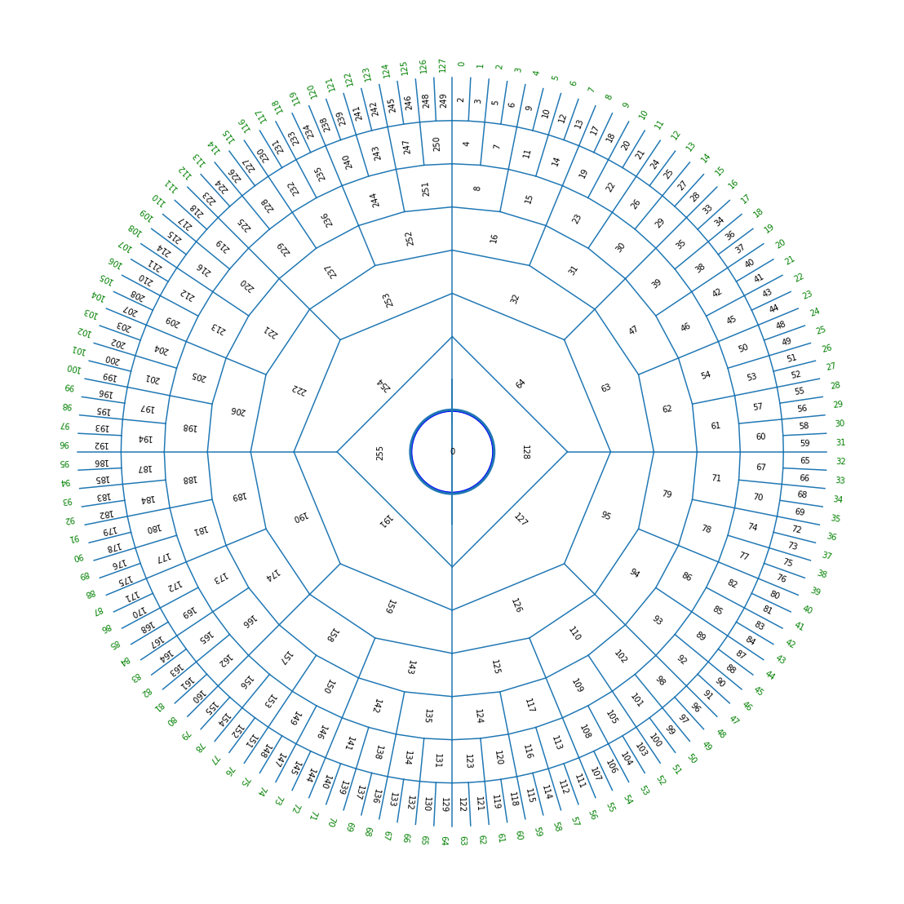

Merkle Queue
============

The use of Merkle Tree structures for append-only logs creates a space-usage issue.
Ideally, entries in the tree could have an explicit expiration date.

- Searching the Merkle tree is a function of a logical clock.
- The highest entry in the tree states what time it is.
- Expired entries need not be checked, and queries to whether such items are in the tree will answer NO, though the hash above expired items is included.
- Entries are leased out by periodically restating them as new statements.

But,

- We want to compact out trash.
- If we are going to have an expiration date, it might as well be set per record.
- We could use the known insertion rate rather than an actual time clock, to make things expire in queue order.
- Users will have to monitor the insertion rate, and renew entries on time.
- The latest record might be able to assert that the queue length shall double.
- A node that does not comply and double its length will have to say that it does not know the answer to out of range queries.
- Larger databases allow for older questions to be answered.
- Expect that there is an inverse exponential distribution for the distance of a question from now.
- This would allow us to deal with the insertion rate.
- The queue length states how far back into the past we are allowed to verify.

Notice that a Heap,

- Uses its index in the array to calculate what its parents are.
- If nodes expire in order, then we can use mod 2^n indexing to allow new entries to overwrite spots where old ones expire.

